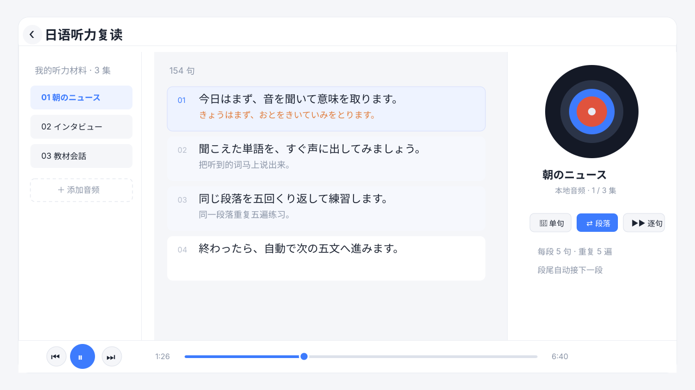

# 日语听力复读播放器

一个本地优先的日语听力复读工具。它提供歌单管理、字幕跟读、单句循环、段落循环和自动逐句播放,适合做 shadowing、听写和精听练习。

> 本项目只提供播放器代码,不提供任何受版权保护的音频、字幕或转写内容。请只导入你自己拥有权利或被授权使用的学习材料。



## 适合谁

- 想把日语广播、教材音频、访谈或影视片段做逐句精听的人。
- 想练 shadowing,但普通播放器来回拖进度太痛苦的人。
- 想把自己的音频和字幕留在本机,不上传到第三方服务的人。

## 特点

- 本地优先:音频和字幕保存在浏览器本地数据库。
- 逐句复读:点击字幕即可跳到对应时间。
- 段落练习:默认每段 5 句、每段重复 5 遍,再自动进入下一段。
- 自带字幕解析:支持 `.srt` / `.lrc` / `.vtt` / `.ass`。
- 零后端:一个静态页面即可运行。

## 快速开始

Mac:

```bash
./start.command
```

Windows:

```bat
start.bat
```

启动脚本会开一个本地小服务并打开浏览器。这样你新建的歌单、添加的音频才能存进浏览器数据库,下次打开还在。

也可以直接打开 `index.html`,但 `file://` 模式下浏览器可能限制本地音频和存储能力。

## 使用方式

1. 首页 `＋` 新建歌单。
2. 进入歌单后点右上角 `＋`,添加本地音频和字幕。
3. 点击字幕句子开始精听。
4. 选择复读模式:
   - `🔁 单句`:循环复读当前句或点选的句子。
   - `⇄ 段落`:按 5 句一段重复 5 遍,之后自动接下一段;也可以点起点句和终点句手动圈选。
   - `▶▶ 逐句`:从当前句开始自动逐句播放,可设置每句重复次数和是否自动下一句。

快捷键:空格 播放/暂停,← → 快退/快进 5 秒,↑ ↓ 上/下一句。

## 添加学习材料

### 临时试听

把音频和字幕拖进页面即可。支持常见音频格式和 `.srt` / `.lrc` / `.vtt` / `.ass` 字幕。

### 保存到本地浏览器

进入歌单后点右上角 `＋`,选择音频和字幕。文件会保存到浏览器 IndexedDB 里,清除站点数据或换浏览器会丢失。

### 本地固定素材

如果你想在自己的电脑上固定加载某些材料:

1. 建文件夹 `episodes/你的材料名/`,放入音频和 `subtitle.js`。
2. 在 `episodes.js` 的 `PLAYLISTS` 里添加配置。
3. `episodes/` 默认被 `.gitignore` 忽略,避免误把版权素材推到公开仓库。

`subtitle.js` 格式:

```js
window.SUBTITLE = [
  [0.0, 5.2, "こんにちは。"],
  [5.2, 11.0, "今日はいい天気ですね。"],
];

window.TRANSCRIPT = [
  [0.0, "", "你好。"],
  [5.2, "", "今天天气真不错。"],
];
```

- `SUBTITLE`:必填,格式为 `[开始秒, 结束秒, 原文]`。
- `TRANSCRIPT`:可选,格式为 `[时间秒, 日语补充, 中文释义]`。

## 转换字幕

```bash
python3 srt2subtitle.py input.srt episodes/my-audio/subtitle.js
```

## 文件结构

```text
.
├── index.html
├── episodes.js
├── srt2subtitle.py
├── start.command
├── start.bat
├── README.md
├── LICENSE
└── episodes/
    └── README.md
```

## 版权说明

本仓库不包含音频、节目转写、商业教材字幕或其他第三方受版权保护内容。使用者需要自行确认导入材料的版权和使用许可。

## 参与改进

欢迎提交 issue 或 pull request。比较适合的改进方向:

- 更好的移动端布局。
- 更多字幕格式兼容。
- 导入/导出歌单。
- 快捷键自定义。
- 多语言界面。

推广素材和 GitHub Topics 建议见 [docs/promotion.md](docs/promotion.md)。

## License

MIT
